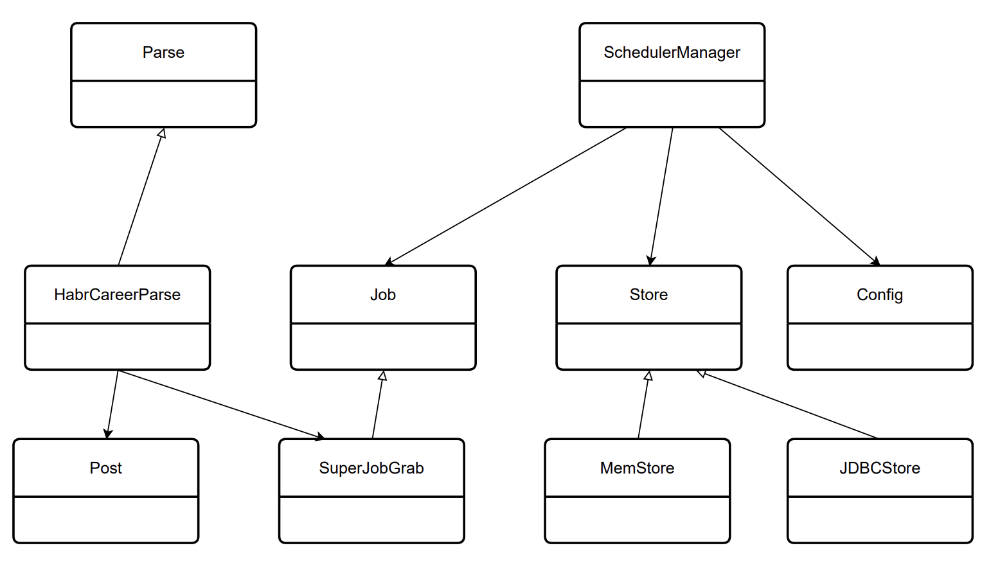

Система запускается по расписанию - раз в минуту.  Период запуска указывается в настройках - application.properties.
Первый сайт будет career.habr.com.
Работаем с разделом https://career.habr.com/vacancies/java_developer.
Программа должна считывать все вакансии c первых 5 страниц относящиеся к Java и записывать их в базу.

### Технологии, используемые в проекте
- Java 17 — основной язык разработки
- Maven — сборка проекта и управление зависимостями
- Quartz Scheduler — планирование и периодический запуск задач
- JSoup — загрузка и парсинг HTML-страниц сайта
- PostgreSQL — основная база данных
- Liquibase — управление миграциями базы данных
- SLF4J + Log4j — логирование работы приложения
- JUnit 5 — модульное тестирование

## Архитектура проекта

### 1. Post 
   Класс Post представляет модель данных, описывающую вакансию. Он включает следующие поля:
   - **id: Long** — уникальный идентификатор вакансии.
   - **name: String** — название вакансии.
   - **link: String** — ссылка на страницу с вакансией.
   - **description: String** — описание вакансии.
   - **created: LocalDateTime** — дата и время публикации вакансии.
   Этот класс содержит геттеры, сеттеры, а также переопределенные методы equals() и hashCode() для корректного сравнения объектов.

### 2. Config 
   Класс Config предназначен для работы с конфигурацией приложения.
   - Содержит поле properties: Properties, которое хранит параметры из конфигурационного файла.
   - Основные методы:
     - **load(String file): void** — загружает свойства из указанного файла.
     - **get(String key): String** — возвращает значение свойства по ключу. 

   Этот класс используется для настройки приложения, например, указания интервала работы парсера.

### 3. Store (интерфейс) 
   Интерфейс Store задает контракт для хранилища вакансий. 
   Методы:
   - **save(Post post): void** — сохраняет вакансию в хранилище.
   - **getAll(): List<Post>** — возвращает все сохраненные вакансии.
   - **findById(Long id): Optional<Post>** — находит вакансию по идентификатору.

### 4. MemStore 
   Класс MemStore реализует интерфейс Store и предоставляет хранилище в памяти.
   -  Использует коллекцию mem: Map<Long, Post> для хранения объектов.
   -  Реализованные методы:
      - **save(Post post): void** — добавляет вакансию в коллекцию. 
      - **getAll(): List<Post>** — возвращает список всех вакансий. 
      - **findById(Long id): Optional<Post>** — находит вакансию по идентификатору в коллекции.

### 5. JdbcStore 
   Класс JdbcStore реализует интерфейс Store для хранения данных в базе PostgreSQL.
   -  Поле connection: Connection используется для взаимодействия с базой.
   -  Методы:
      - **save(Post post): void** — сохраняет вакансию в базе данных. 
      - **getAll(): List<Post>** — извлекает все вакансии из базы. 
      - **findById(Long id): Optional<Post>** — находит вакансию по идентификатору.

### 6. Parse (интерфейс) 
   Интерфейс Parse описывает операции для парсинга данных с веб-сайтов.
    Метод:
   - **fetch(): List<Post>** — возвращает список вакансий.

### 7. HabrCareerParse 
   Класс HabrCareerParse реализует интерфейс Parse. Используется для парсинга вакансий с платформы career.habr.com.
   -  Поля:
      - **SOURCE_LINK: String** — базовая ссылка на сайт. 
      - **PREFIX: String** — префикс для ссылок на страницы с вакансиями. 
      - **SUFFIX: String** — параметры для фильтрации вакансий.
   - Метод **fetch()** загружает и обрабатывает HTML-страницы, извлекая данные о вакансиях.

### 8. SchedulerManager 
   Класс SchedulerManager управляет задачами парсинга через библиотеку Quartz.
   - Поля:
      - **scheduler: Scheduler** — объект для управления расписанием задач.
   - Методы:
      - **init(): void** — инициализирует планировщик. 
      - **load(int period, Class<SuperJobGrab> task, Store store): void** — создает и запускает задачу с указанным интервалом. 
      - **close(): void** — завершает работу планировщика.

### 9. SuperJobGrab 
   Класс SuperJobGrab реализует интерфейс Job (из Quartz) и отвечает за выполнение задачи парсинга.
   - Поле:
      - **parse: Parse** — объект, реализующий логику парсинга.
   - Метод:
      - **execute(JobExecutionContext context): void** — выполняет задачу парсинга и сохраняет данные через хранилище (Store).

### 10. Main 
   Класс Main является точкой входа в приложение.
   - Основной метод:
      - **main(String[] args): void** — настраивает приложение, запускает парсинг вакансий и сохраняет их в хранилище.

### Архитектурные связи
- Post используется везде как основная модель данных.
- Config загружает параметры для работы приложений.
- Store, MemStore, и JdbcStore обеспечивают хранение данных.
- Parse и HabrCareerParse отвечают за извлечение вакансий.
- Grab и SchedulerManager управляют периодическим запуском.
- Main связывает все компоненты для работы приложения.

### Схема связей
